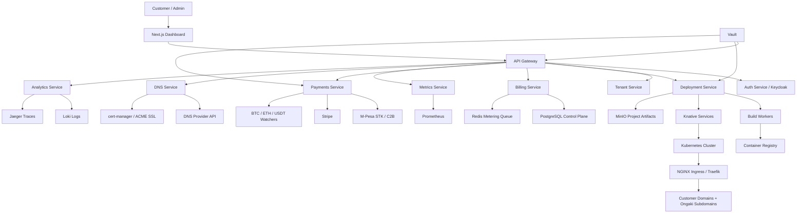

# Ongaki Cloud Architecture Blueprint

Ongaki Cloud is a multi-tenant serverless cloud platform for websites, APIs, serverless functions, databases, business systems, domains, SSL, analytics, billing, and payments across card, mobile money, crypto, and internal wallet rails.

This directory is an implementation-ready starter pack. It is designed for a Kubernetes-first platform using Knative for serverless workloads, MinIO for S3-compatible object storage, PostgreSQL for the control plane, Redis for fast metering queues, Keycloak for identity, Vault for secrets, Prometheus/Grafana/Loki/Jaeger for observability, Terraform for infrastructure, and ArgoCD/GitHub Actions for deployment.

## Run The Local MVP

The local MVP runs without Kubernetes so you can test the control-plane workflow immediately.

```powershell
cd "C:\Users\Admin\Documents\New project\ongaki-cloud"
npm start
```

Open [http://localhost:4010](http://localhost:4010).

The app stores local demo data in `ongaki-cloud/data/control-plane.json`. It includes a seeded tenant, project, deployment log, usage invoice, and payment recording flow.

Local MVP views:

- Client side: [http://localhost:4010/client](http://localhost:4010/client)
- Backend side: [http://localhost:4010/admin](http://localhost:4010/admin)
- Users side: [http://localhost:4010/site/demo-api](http://localhost:4010/site/demo-api)

## System Architecture



## Repository Structure

```text
ongaki-cloud/
  README.md
  database/schema.sql
  docs/api/openapi.yaml
  infra/kubernetes/base.yaml
  infra/kubernetes/security-policies.yaml
  infra/monitoring/prometheus-values.yaml
  infra/terraform/main.tf
  scripts/deploy.ps1
  services/autoscaler/src/scaler.ts
  services/billing-engine/src/billingEngine.ts
  services/billing-engine/src/pricing.ts
  services/payments/src/payments.ts
```

## Control Plane Services

Auth Service validates JWT/OAuth2 sessions from Keycloak, manages API key rotation, and emits audit events.

Tenant Service owns tenant lifecycle, namespaces, quotas, role bindings, bucket names, database names, and rate limits.

Deployment Service accepts Git or archive uploads, stores artifacts in MinIO, detects the framework, builds OCI images, pushes them to a registry, and creates Knative services.

Function Runtime Service runs customer functions as Knative services with scale-to-zero, revision routing, request timeouts, per-tenant secrets, and log shipping.

DNS Service provisions `project.tenant.ongaki.cloud`, validates custom domains, creates DNS records, and requests certificates through cert-manager.

Metrics Service scrapes Prometheus, normalizes usage records, and writes immutable usage facts.

Billing Service aggregates usage by billing cycle, calculates wallet debits, subscriptions, taxes, invoices, credits, and account suspension status.

Payments Service handles M-Pesa, Stripe, Bitcoin, Ethereum, USDT, and internal wallet ledger events.

Analytics Service exposes request metrics, bandwidth, geographic traffic, deployment events, function errors, logs, and traces.

Notification Service sends email, dashboard, webhook, and SMS events for deployment status, invoices, failed payments, quota warnings, and incidents.

Admin Portal includes revenue, infrastructure cost, cluster status, active deployments, node health, fraud flags, resource heatmaps, and alert triage.

## Deployment Flow

1. User creates a project and uploads a zip file or connects a Git repository.
2. Deployment Service stores the source bundle in a tenant-scoped MinIO bucket.
3. Build Worker detects framework using `package.json`, `next.config.*`, `vite.config.*`, `Dockerfile`, `requirements.txt`, or static file signatures.
4. Build Worker creates an OCI image using Cloud Native Buildpacks or a user Dockerfile.
5. Image is pushed to the registry as `registry.ongaki.cloud/{tenant}/{project}:{deployment_id}`.
6. Deployment Service creates a Knative Service in namespace `tenant-{tenant_slug}`.
7. DNS Service assigns `{project_slug}-{tenant_slug}.ongaki.cloud`.
8. cert-manager provisions TLS through ACME DNS-01 or HTTP-01.
9. CDN and ingress cache policies are attached by project type.
10. Metrics Service starts ingesting Prometheus, ingress, function, database, storage, and CDN usage.
11. Billing Service aggregates usage into the active billing cycle.

## Multi-Tenant Isolation

Each tenant receives:

- A Kubernetes namespace named `tenant-{slug}`.
- NetworkPolicy that denies cross-tenant traffic by default.
- ResourceQuota and LimitRange.
- Dedicated MinIO bucket prefix `tenant/{tenant_id}/`.
- Dedicated PostgreSQL schema or database for managed databases.
- Tenant-scoped Vault path `kv/tenants/{tenant_id}`.
- Tenant API keys with rotation and expiration.
- Per-tenant Prometheus labels, log labels, quotas, and rate limits.

## Usage Pricing Model

The customer-facing monthly cost is a sum of metered resource dimensions. The prompt used multiplication between dimensions; production billing should sum dimensions so a zero in one dimension does not erase all other charges.

```text
monthly_cost =
  cpu_seconds * cpu_price +
  memory_gb_seconds * memory_price +
  bandwidth_gb * network_price +
  storage_gb_month * storage_price +
  api_requests * api_price +
  function_calls * invocation_price +
  db_reads * db_read_price +
  db_writes * db_write_price +
  cdn_gb * cdn_price +
  certificate_count * ssl_price
```

Concrete starter rates are encoded in [pricing.ts](services/billing-engine/src/pricing.ts).

## MVP Plan

1. Launch tenant accounts, Keycloak auth, project CRUD, static site deploys, MinIO artifact storage, NGINX ingress, automatic subdomains, and logs.
2. Add Knative dynamic APIs, framework detection, build workers, Prometheus metrics, usage records, and basic wallet billing.
3. Add custom domains, cert-manager SSL, Stripe and M-Pesa payments, invoices, and quota enforcement.
4. Add managed PostgreSQL/Redis, crypto deposits, admin portal, fraud detection, and regional routing.
5. Add marketplace templates, private networking, team roles, audit exports, and enterprise support controls.

## Production Roadmap

Months 1-2: Build control plane, auth, project model, deployment worker, object storage, static hosting, dashboard shell, and CI/CD.

Months 3-4: Add Knative runtime, metrics ingestion, logs, billing cycles, Stripe, M-Pesa, invoices, custom domains, and SSL.

Months 5-6: Add managed databases, crypto payment watchers, admin portal, fraud rules, quota enforcement, backups, and disaster recovery drills.

Months 7-9: Add multi-region deployments, CDN routing, marketplace, enterprise RBAC, WAF integration, regional cost allocation, and SLA reporting.

## Cost Estimates

Small MVP cluster in one region:

- 3 Kubernetes worker nodes, 4 vCPU and 16 GB RAM each: USD 300-600/month depending on provider.
- Managed PostgreSQL primary with backups: USD 80-250/month.
- Object storage for artifacts/log archives: USD 20-100/month at early scale.
- Registry, DNS, observability storage, and monitoring: USD 100-300/month.
- Payment provider fees: provider-specific transaction percentage plus fixed fees.

Production regional cluster:

- 6-12 worker nodes plus autoscaling buffer: USD 1,500-6,000/month.
- HA PostgreSQL, Redis, Vault, observability retention, and backups: USD 1,000-4,000/month.
- CDN and bandwidth dominate at scale; track per-tenant gross margin daily.

## Regional Scaling Plan

Start in one primary region close to the initial market, for example East Africa or EU depending on latency and compliance needs. Add read replicas for control-plane queries, then add workload regions with independent Kubernetes clusters. Keep the control plane global but make deployments region-aware. Use global DNS latency routing for customer domains and keep tenant data residency pinned by policy.

## Data Center Migration Strategy

Run destination clusters in parallel. Replicate PostgreSQL with logical replication, mirror MinIO buckets, sync registry images, and install the same ArgoCD apps. Freeze high-risk deploy operations during final cutover, lower DNS TTL to 60 seconds, shift canary tenants, validate billing totals and logs, then migrate remaining tenants by region. Keep source read-only for at least one billing cycle.

## Disaster Recovery Plan

Recovery objectives:

- Control plane RPO: 15 minutes.
- Control plane RTO: 2 hours.
- Customer static assets RPO: 15 minutes.
- Runtime workloads RTO: 1 hour in a warm standby region.

Controls:

- PostgreSQL PITR with daily restore tests.
- MinIO bucket replication and versioning.
- Registry replication for released images.
- GitOps manifests in source control and ArgoCD app-of-apps.
- Vault snapshots with sealed recovery keys stored offline.
- Quarterly failover exercises and invoice reconciliation after failback.

## Security Baseline

All public traffic uses TLS 1.2 or newer. APIs require JWT or signed API keys. Tenant workloads run with restricted Pod Security, non-root containers, read-only root filesystems where possible, default-deny network policies, Vault-sourced secrets, per-tenant quotas, audit logs, WAF rules, and rate limits. Admin actions require MFA and are logged to immutable audit storage.
